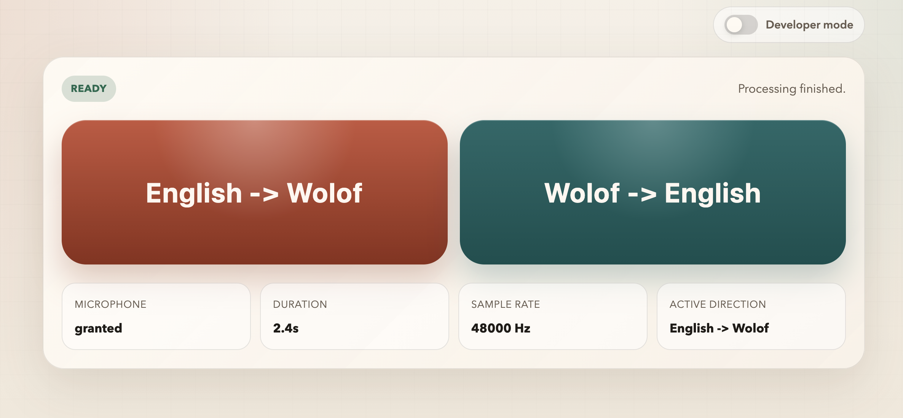

# Wolof Translate

`wolof-translate` is a local browser-based prototype for spoken **English <-> Wolof** translation.

Current pipeline:

- `english_to_wolof`: browser audio -> `whisper.cpp` -> Wolof text -> local Wolof TTS server -> Wolof audio
- `wolof_to_english`: browser audio -> `whisper.cpp` -> Wolof text -> local translation server -> English text -> macOS `say`
- `text_to_wolof_audio`: English text -> local English-to-Wolof text/TTS server -> Wolof audio

The UI is served from `web_server.py` and lives in `webapp/`.

## Screenshot



## Requirements

- Python `3.12+`
- `pip` (or uv)
- A separate `whisper.cpp` checkout with the HTTP server binary built
- Two GGUF Whisper models:
  - `whisper-medium-english-2-wolof.gguf`: https://huggingface.co/Tiebing/whisper-medium-english-2-wolof
  - `whisper-small-wolof.gguf`: https://huggingface.co/Tiebing/whisper-small-wolof
- Audio playback:
  - macOS: built-in `say` is used for English playback

## Installation

### 1. Create a virtual environment

```bash
python3.12 -m venv .venv
source .venv/bin/activate
python -m pip install --upgrade pip
pip install .
```

This installs the Python dependencies declared in `pyproject.toml`:

- `numpy`
- `soxr`
- `torch`
- `transformers`

The first time you start the Python services, Hugging Face model weights may be downloaded and cached locally. That can take a while.

Download the two GGUF files for `whisper.cpp` from:

- https://huggingface.co/Tiebing/whisper-medium-english-2-wolof
- https://huggingface.co/Tiebing/whisper-small-wolof

### 2. Prepare `whisper.cpp`

This repository does not vendor `whisper.cpp`. Build it separately, then point the run commands below at the server binary from that checkout.

Recent `whisper.cpp` builds often expose the server as:

```bash
~/code/whisper.cpp/build/bin/whisper-server
```

The examples below use an environment variable so you can swap in whichever binary your checkout produced.

## Run It

Start each service in its own terminal from the repository root.

### 1. Start the English -> Wolof `whisper.cpp` server

```bash
export WHISPER_SERVER=~/code/whisper.cpp/build/bin/whisper-server

$WHISPER_SERVER \
  --port 8080 \
  -m /absolute/path/to/whisper-medium-english-2-wolof.gguf
```

If your checkout uses `whisper-server` instead of `build/bin/server`, set `WHISPER_SERVER` accordingly.

### 2. Start the Wolof -> English `whisper.cpp` server

```bash
$WHISPER_SERVER \
  --port 8081 \
  -m /absolute/path/to/whisper-small-wolof.gguf
```

### 3. Start the English text -> Wolof audio server

```bash
source .venv/bin/activate
python translate.py --port 8000
```

This server accepts English text at `/speak`, translates it to Wolof, and writes generated WAV files under `generated_audio/`.

### 4. Start the Wolof speech server

```bash
source .venv/bin/activate
python wolof_speech_server.py --port 8001
```

This server loads the Wolof SpeechT5 model and writes generated WAV files under `generated_audio/`.

### 5. Start the Wolof -> English translation server

```bash
source .venv/bin/activate
python wolof_to_english_translate_server.py --port 8002
```

### 6. Start the web app server

```bash
source .venv/bin/activate
python web_server.py --port 8090
```

### 7. Open the UI

Open:

```text
http://127.0.0.1:8090
```

Then:

1. Press and hold `English -> Wolof` or `Wolof -> English`
2. Speak
3. Release to upload the WAV recording
4. Wait for the job stages to complete in the UI

The browser client records audio and uploads it as `utterance.wav`, so you do not need to prepare WAV files manually for normal use.

## Text API

The web server also accepts English text directly and returns the same async job shape used by audio uploads:

```bash
curl -sS -X POST http://127.0.0.1:8090/api/text-translate-speak \
  -H 'Content-Type: application/json' \
  -d '{"text":"Good morning. How are you?"}'
```

The response includes a `request_id` and `status_url`:

```json
{
  "request_id": "abc12345",
  "status": "queued",
  "stage": "queued",
  "direction": "english_to_wolof",
  "status_url": "/api/requests/abc12345",
  "poll_after_ms": 500
}
```

Poll until `status` is `completed`:

```bash
curl -sS http://127.0.0.1:8090/api/requests/abc12345
```

Then download the generated Wolof audio:

```bash
curl -sS http://127.0.0.1:8090/api/requests/abc12345/audio \
  -o wolof-output.m4a
```

## Notes

- `speaker_embeddings/default.npy` is already included in the repo and is used by the Wolof TTS server by default.
- `web_server.py` expects the `whisper.cpp` inference endpoints at:
  - `http://127.0.0.1:8080/inference`
  - `http://127.0.0.1:8081/inference`
- `web_server.py` expects the English text -> Wolof audio service at `http://127.0.0.1:8000/speak`.
- If you want faster server startup, both Python model servers support `--lazy` to defer model loading until the first request.
- `start-all.sh` and `scripts/auto-start-all.sh` show the expected port layout, but they hardcode local paths and are not general-purpose launchers as-is.

## Resources and Models

### ASR

- https://huggingface.co/M9and2M/whisper-small-wolof - Wolof ASR, WER 0.17.
- https://huggingface.co/CAYTU/whosper-large-v2 - multilingual ASR for Wolof, French, and English; WER 0.2345.
- https://huggingface.co/soynade-research/Wolof-HuBERT-CTC - Wolof ASR, WER 0.3565.

### Speech Translation

- https://huggingface.co/bilalfaye/whisper-medium-wolof-2-english - Wolof speech to English text, BLEU 25.3308.
- https://huggingface.co/bilalfaye/whisper-medium-english-2-wolof - English speech to Wolof text, BLEU 34.6061.

### TTS

- https://huggingface.co/bilalfaye/speecht5_tts-wolof-v0.2 - Wolof and French SpeechT5 TTS.
- https://huggingface.co/galsenai/xTTS-v2-wolof - Wolof xTTS v2.
- https://huggingface.co/soynade-research/Oolel-Voices - 0.5B, F32 voice model.

### Text Translation

- https://huggingface.co/bilalfaye/nllb-200-distilled-600M-wolof-english
- https://huggingface.co/bilalfaye/nllb-200-distilled-600M-wo-fr-en
- https://huggingface.co/soynade-research/Oolel-v0.1 - 8B, based on Qwen-2.5.
- https://huggingface.co/soynade-research/Oolel-Small-v0.1 - 2B, based on Qwen-2.
- https://huggingface.co/LocaleNLP/eng_wolof - English to Wolof, 77M.
- https://huggingface.co/LocaleNLP/localenlp-wol-eng-0.03 - Wolof to English; weak on simple Wolof phrases.

### Related Apps

- https://github.com/niedev/RTranslator
- https://github.com/sudoping01/wolof-tts - Wolof TTS based on a fine-tuned xTTS v2 model by GalsenAI; requires Docker and CUDA.

### Model Notes

- https://huggingface.co/facebook/seamless-m4t-v2-large - does not support Wolof.

### Organizations

- https://huggingface.co/soynade-research - Soynade Research.
